# NoiEst

1. [Источники](#источники)
2. [Участники](#участники)
3. [Задачи](#задачи)
4. [Расчёты](#расчёты)
5. [Визуализация](#визуализация)
6. [Результаты](#результаты)

## Источники
описание измеряемых параметров
- https://www.aapm.org/pubs/reports/RPT_233.pdf
- https://aapm.onlinelibrary.wiley.com/doi/epdf/10.1118/1.4893497
- https://aapm.onlinelibrary.wiley.com/doi/pdfdirect/10.1118/1.4884038
- https://aapm.onlinelibrary.wiley.com/doi/pdfdirect/10.1118/1.4867863
	
пример ПО - посмотреть, какие GUI делают в таких задачах	https://www.researchgate.net/publication/361718292_iQMetrix-CT_New_software_for_task-based_image_quality_assessment_of_phantom_CT_images

пример проекта на matlab для расчета характеристик	https://gitlab.oit.duke.edu/railabs/SameiResearchGroup/imquest

## Участники
### Лебкова Марина:
- [Ссылка](https://github.com/hedanta/misis2023f-22-02-lebkova-m-d) на личное хранилище
- реализация расчёта и визуализации карты шумов, гистограммы карты шумов, маскирования шумового изображения на области с высокой и низкой частотой шума

### Гороховатский Всеволод
- [Ссылка](https://github.com/zgushonkaK/misis2023f-22-02-gorokhovatskii-v-m) на личное хранилище
- реализация алгоритма расчёта автокорреляции с последующими преобразованиями и визуализация кривых спектра шумов

## Задачи
- [x] изучить разделы "2.D. Quantum noise assessment" и "APPENDIX: AUTOCORRELATION ALGORITHM" статьи "Quantum noise properties of CT images with anatomical textured backgrounds across reconstruction algorithms: FBP and SAFIRE"
- [x] сделать хорошее описание что и как посчитать (с формулами)
- [x] сделать хорошее описание что и как визуализировать (с примерами иллюстраций из статьи)
- [x] разобраться с синтезированным шумом и работой с float
- [x] написать сохранение выводимых изображений в файлы
  - [x] добавить в readme предварительные результаты
- [x] реализовать функцию автокорреляции шума
- [x] добавить cmake install
- [x] понять преобразование Фурье 
- [x] продумать структуру

## Расчёты
### Для справок

- Region of interest (ROI) - локальная рассматриваемая область 
- В целом, шум КТ нестационарный, но часто (и в рамках этой работы) он считается локально неподвижным в пределах ROI
### Величина шума

$\sigma(\vec{x})$ - стандартное отклонение по ансамблю повторяющихся изображений $I(\vec{x})$:
$$\sigma_{i} = \sqrt { \frac {1}{M - 1} \sum_j^M \left[I_{i, j} - \overline{I_{i}}\right]^2 },$$
где  
$\sigma_{i}$ - величина шума i-го вокселя,  
$M$ - количество повторных сканирований,  
$I_{i, j}$ - единица Хаунсфилда (HU, CT number) i-го вокселя в j-ом изображении,  
$\overline{I_{i}}$ - среднее значение HU i-го вокселя по ансамблю повторных изображений.  

### Автокорреляция шума

Описывает корреляцию между любыми двумя значениями шумных пикселей.

Автокорреляция $R_{N}(x_{1}, y_{1};x_{2}, y_{2})$ определяется как средняя корреляция между пикселями в точках $(x_{1},y_{1})$ и $(x_{2},y_{2})$:
$$R_{N}(x_{1}, y_{1}; x_{2}, y_{2}) = E[N(x_{1}, y_{1}) - N(x_{2}, y_{2})], $$
где E[] - оператор ожидания.
Является функцией расстояния между вокселями в направлениях $x$ и $y$:  
$R_{N}(x_{1}, y_{1};x_{2}, y_{2}) \rightarrow R_{N}(\Delta x, \Delta y)$  

Копия шумового изображения $N(x,y)$ накладывается на оригинал для заданного лага (отставание? задержка?) ($\Delta x, \Delta y$). Попиксельно перемножаются перекрытые пиксели (серая зона) и результат суммируется по всем перекрывающим пикселям. Эта сумма представляет собой одно значение автокорреляции. Процесс производится для всех позиций лага. 

Математическая суммарная корреляция для изображения разрешения $P \times P$ имеет вид:
$$R_{Nsum}(\Delta x, \Delta y) = \sum_{x=0}^{P-1} \sum_{y=0}^{P-1}N(x,y) \cdot N(x-\Delta x, y - \Delta y)$$
Итоговая средняя корреляция:
$$R_{n}(\Delta x, \Delta y) = \frac{R_{Nsum}(\Delta x, \Delta y)}{n(\Delta x, \Delta y)},$$где $n(\Delta x, \Delta y)$ - количество пикселей, участвовавших в вычислении суммарной корреляции.

Автокорреляция для произвольно сформированной области в пределах $N(x, y)$:

$X$ - умножение по пикселям, $\div$ - деление по пикселям, а $R$ - операция автокорреляции суммы.

Пусть ROI задан бинарной маской $M(x, y)$, которая имеет значение 1 для пикселей, находящихся в области, и 0 для пикселей, не находящихся в области.
1. Попиксельно умножается $N(x, y)$ на $M(x, y)$ для получения маскированного изображения $N^\prime (x, y)$
2. Для $N'(x, y)$ вычисляется суммарная корреляция $R_{N^{\prime}sum}(\Delta x, \Delta y)$
3. Вычисляется количество пикселей, участвовавших в суммировании для каждого положения лага:
   $$n^\prime (\Delta x, \Delta y) = R_{Msum}(\Delta x, \Delta y) = \sum_{x=0}^{P-1} \sum_{y=0}^{P-1}M(x,y) \cdot M(x-\Delta x, y - \Delta y)$$
4. Итоговая автокорреляция $R_{N^\prime}$ в пределах ROI вычисляется следующим образом:
$$R_{N^\prime}(\Delta x, \Delta y) = \frac{R_{N^{\prime}sum}(\Delta x, \Delta y)}{R_{Msum}(\Delta x, \Delta y)}$$
Важно, что $n^\prime (\Delta x, \Delta y)$ должно быть ненулевым (в исследовании все оцененные автокорреляционные функции были обрезаны до максимального расстояния запаздывания $\pm 128$ пикселей в обоих направлениях).
### Спектр мощности шума

NPS - преобразование Фурье автокорреляции шума, описывает распределение дисперсии шума

**NPS для заданного ROI рассчитывается по формуле** (в данной работе 2D):
$$NPS(\vec{u}) = v_{\vec{x}} \cdot \left| \mathcal{F} [R_{N} (\Delta \vec{x})]\right|,$$
где
$\vec{u}$ - вектор пространственных частот ($\vec{u} = [u, v]$),  
$v_{\vec{x}}$ - размер пикселя ($\vec{x} = [x, y]$),  
$\Delta \vec{x}$ - расстояние между двумя пикселями,  
$|\mathcal{F}[]|$ - величина дискретного преобразования Фурье.

## Визуализация

1) Из имеющегося изображения $I(\vec{x})$ попиксельно вычесть среднее изображение ансамбля $\mu(\vec{x})$ и получить изображение с нулевым средним шумом $N(\vec{x})$
2) Умножить $N(\vec{x})$ на маску $M(\vec{x})$ с внутренним радиусом 40 пикселей и внешним радиусом 140 пикселей, в результате чего получится небольшая область $N'(\vec{x})$
3) Построить карту шумов $\sigma(\vec{x})$ как стандартное отклонение
4) По карте шумов построить гистограмму величины шумов и определить порог. Все значения левее него считаются низким шумом, правее - высоким.
5) По вышеуказанному разделению получить бинарные маски для областей с низким и высоким шумом: $M(\vec{x})_ {Low}$ и $M(\vec{x})_ {High}$
8) Умножить небольшую область $N'(\vec{x})$ на каждую маску и получить отдельные ROI для низкого и высокого шума: $N(\vec{x})_ {Low}$ и $N(\vec{x})_ {High}$
9) Вычислить автокорреляции шума $R_{N}$ для каждой полученной области: $R_{N}(\Delta \vec{x}_ {Low})$ и $R_{N}(\Delta \vec{x}_{High})$
10) Применить преобразование Фурье к вычисленным автокорреляциям шума и метод радиального группирования, чтобы получить спектры мощности шума: $NPS(u,v)_ {Low}$ и $NPS(u,v)_ {High}$
11) Построить кривые $NPS(r)_ {Low}$ и $NPS(r)_ {High}$

Радиальное группирование для получения $NPS(r)$:
группируется $NPS(u, v)$ в соответствии с радиальным расстоянием, $r = \sqrt {u^2 + v^2}$, и берётся среднее значение для каждой ячейки (?)
 
 

## Результаты
### Для однородного шума
Исходное изображение: 

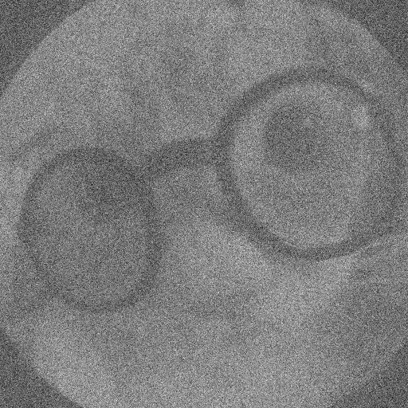

Среднее ансамбля: 

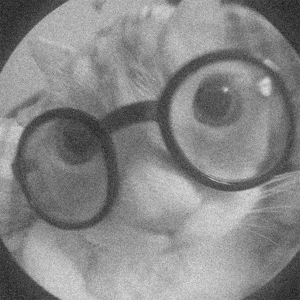

Шум изображения: 

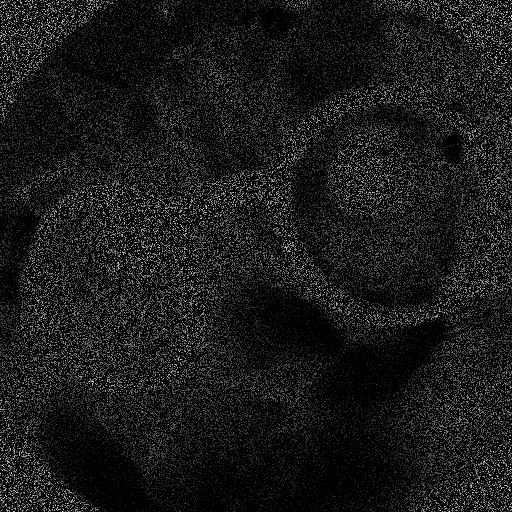

Карта шумов: 

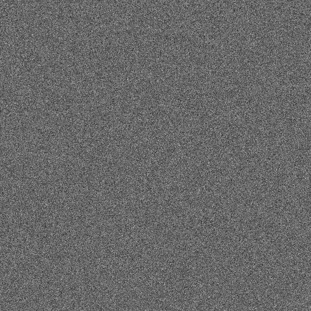

Гистограмма шумов: 

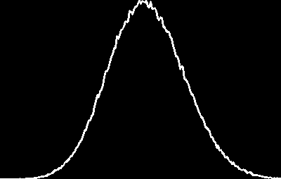

Область интереса (ROI): 

Маска с низким шумом:

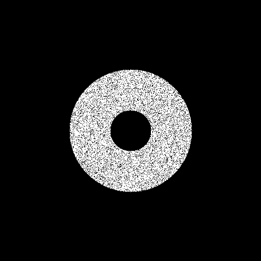

Маска с высоким шумом:

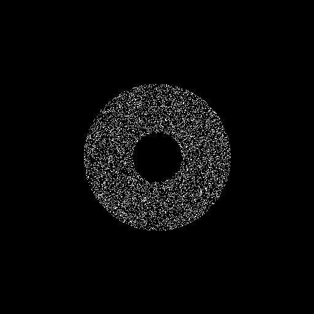

Область с низким шумом:

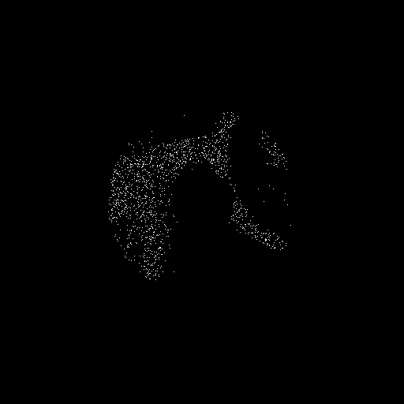

Область с высоким шумом:

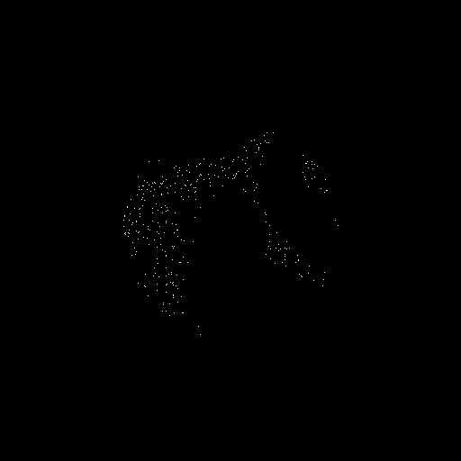

Автокорреляция области с низким шумом:

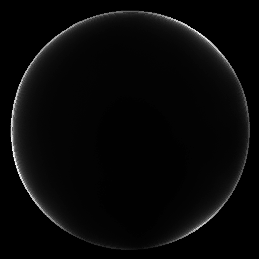

Автокорреляция области с высоким шумом:

Дискретное преобразование Фурье низкого шума:

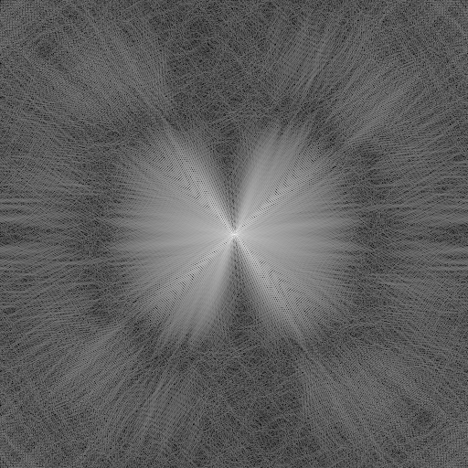

Дискретное преобразование Фурье высокого шума:

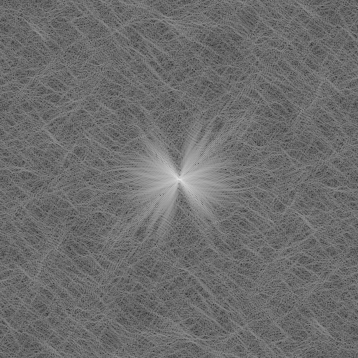

Кривая спектра низкого шума:

Кривая спектра высокого шума:

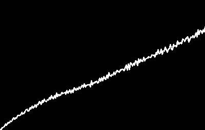

### Для неоднородного шума
Исходное изображение: 

Среднее ансамбля: 

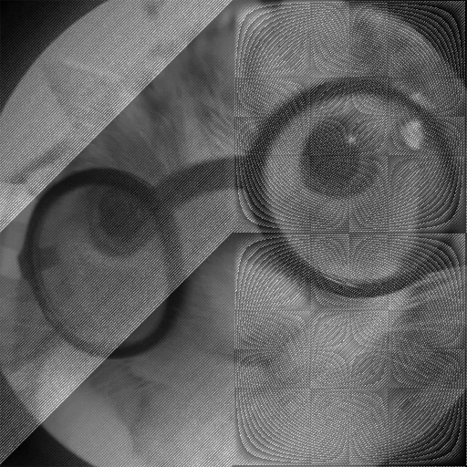

Шум изображения: 

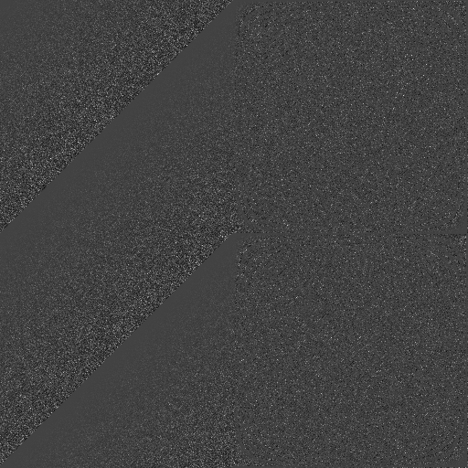

Карта шумов: 

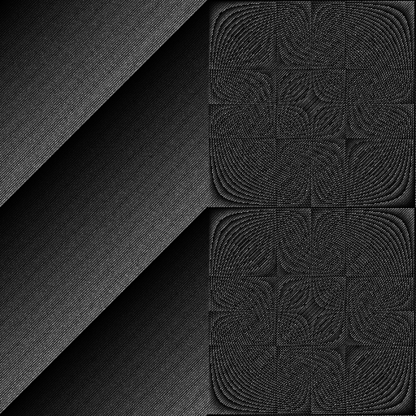

Гистограмма шумов: 

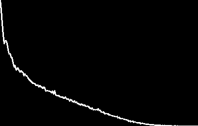

Область интереса (ROI): 

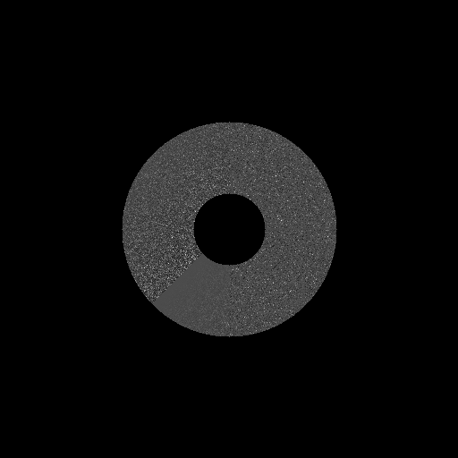

Маска с низким шумом:

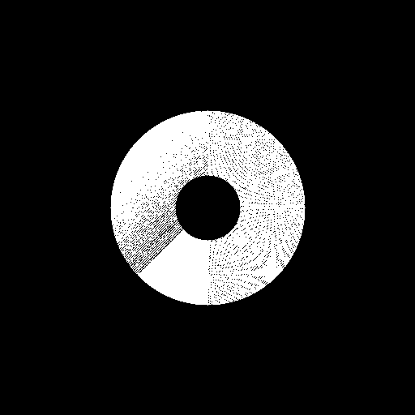

Маска с высоким шумом:

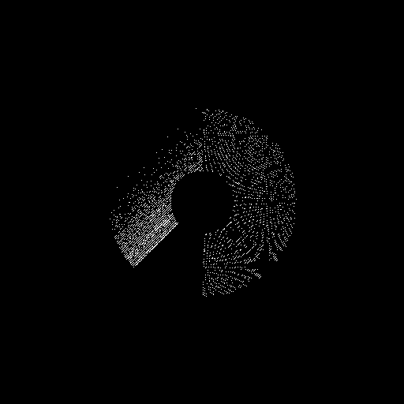

Область с низким шумом:

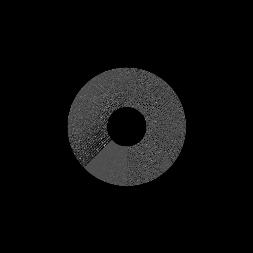

Область с высоким шумом:

Автокорреляция области с низким шумом:

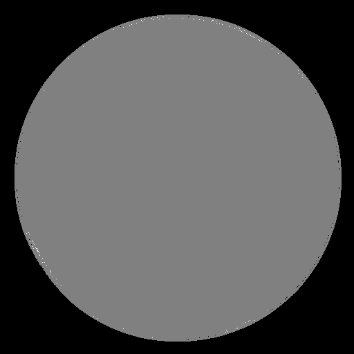

Автокорреляция области с высоким шумом:

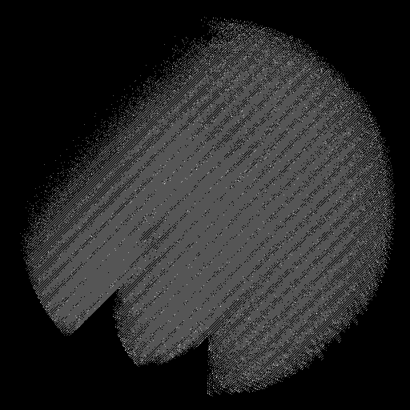

Дискретное преобразование Фурье низкого шума:

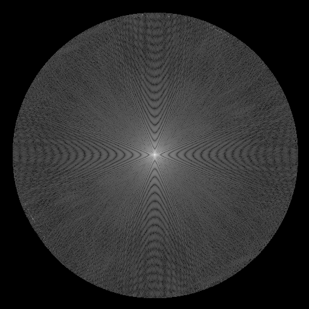

Дискретное преобразование Фурье высокого шума:

Кривая спектра низкого шума:

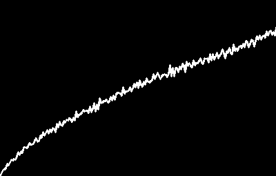

Кривая спектра высокого шума:

